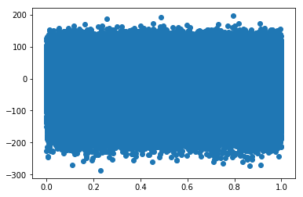
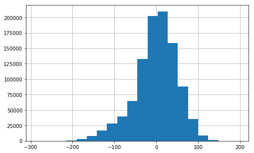

### Questions
- what makes a tensor different in python? 

### Keyterms
- **Rank (row and column)**: number of non zero rows of matrix (or it's transpose), after matrix has been converted to row echelon form
- **Linear Operations**:vectors $v_1, v_2$ can have linear operations applied to them in the form $c_1v_1 + c_2v_2=v_3$. 
    - In other words, multiplying vectors by a constant $c$ or adding vectors together are linear operations. 
    - Linear operations preserve the following in a matrix
        - Rank
        - Inverse (if the inverse exists)
        - They send the zero vector $v_0$ to $v_0$
        - Eigen Decomposition (if Matrix is square)
- **Linear Dependence**: A Matrix is linearly dependent iff $\exists v_i \in M$ such that $v_i = \sum \alpha_j v_j$, for one or more $v_j \in M$ and $\alpha_j \neq 0$
    - In other words, one of the vectors $v_i$ in M can be written as a linear combination of some of other vector(s) in M.
- **Linear Independence**: A Matrix is linear independent iff it isn't linear dependent. 
- **Ridge Regression** - We'll discuss this later

### Objectives
YWBAT
- describe the importance of linear independence
- explain how linear independence effects OLS
- define a dot product and what it tells us about vectors
- cosine similarity and what it tells us about vectors
- define matrix multiplication
- define matrix inverses
- big O notation - what is it? why should we care about it? 

### Outline


```python
import pandas as pd
import numpy as np

from sklearn.metrics.pairwise import cosine_similarity, cosine_distances

import matplotlib.pyplot as plt
```


```python
# a vector is a list of numbers
v1 = np.array([3, 4])
v1_length = np.linalg.norm(v1)
v2 = np.array([-5, 12])
v2_length = np.linalg.norm(v2)

v1_angle = np.math.atan(4/3)
v2_angle = np.math.atan(12/5)

v1_length, v2_length, v1_angle, v2_angle
```


    (5.0, 13.0, 0.9272952180016122, 1.176005207095135)


```python
v1.shape, v2.shape # vectors have no columns (only row) so there isn't a 2nd dimension

```


    ((2,), (2,))


```python
cosine_distances([v1, v2])
```


    array([[0.        , 0.49230769],
           [0.49230769, 0.        ]])


```python
v3 = np.array([3, 5])
v1 = np.array([3, 4])

cosine_distances([v1, v3])
```


    array([[0.        , 0.00530821],
           [0.00530821, 0.        ]])


```python
cosine_similarity([v1, v3]), cosine_similarity([v1, v2])
```


    (array([[1.        , 0.99469179],
            [0.99469179, 1.        ]]), array([[1.        , 0.50769231],
            [0.50769231, 1.        ]]))


```python
# Dot Product 

v1 = np.array([10, 0])
v2 = np.array([0, 10])

# the angle between v1 and v2 = 90 degrees or pi/2 radians

v1.dot(v2) # dot product = 0 when 2 vectors are orthogonal (right angle)

v2.dot(v1)
```


    0


```python
v1 = np.random.randint(0, 10, size=(3,))

v2 = np.random.randint(0, 10, size=(3,))

v1.dot(v2), v2.dot(v1) # commutative in other words v1 dot v2 = v2 dot v1
```


    (65, 65)


# Properties of Vectors
- Magnitude (Norms)
    - Hypotenuse of that right triangle
- Direction
    - 
- Straight line segment

# Relationships between pairs of Vectors
- Share the origin (0, 0)
- Distance between the vectors
    - Euclidean Distance
    - Angle between vectors
        - cosine similarity
    - Dot Product

### What does it mean for a space to be linear independent 
    - No vectors are parallel


Why is this important? (From stats-exchange)
```
Recall from linear algebra that linearly dependent vectors are a set of vectors which can be expressed as a linear combination of each other. When performing regression, this creates problems because the matrix 𝑋𝑇𝑋 is singular, so there is not a uniquely defined solution to estimating your regression coefficients. (The matrix 𝑋𝑇𝑋 is important because of its role in estimating OLS regression coefficients 𝛽̂ : 𝛽̂ =(𝑋𝑇𝑋)−1𝑋𝑇𝑦.)

Linear dependence is a technical phenomenon distinct from the ordinary usage of "dependence" as you express it.

So with an understanding of linear dependence in hand, we can begin to examine likely sources of this problem.

More features than rows It's unclear how much data you have, but it's possible that by adding polynomial terms, you're inadvertently creating a dimensionality problem: an ordinary regression with more columns than observations will fail! This is because the system of equations that you've defined has infinitely many solutions, i.e. there is not a pivot point in every column. This amounts to the same problem as having a singular 𝑋𝑇𝑋.

Duplicate data Even if you have more rows than features, it's important that each of those rows provides unique information. Duplicate rows are unhelpful in this context. By definition, the polynomial regression matrix 𝑋 (consisting of [1,𝑥,𝑥2,...𝑥𝑚] as columns) is a Vandermonde matrix, so it will have a unique OLS solution provided that there are 𝑚+1 unique entries in your original 𝑥 vector. So despite having 100 observations, perhaps you have a smaller number of unique 𝑥 entries?

Ill-conditioned matrix Even if neither (1) nor (2) is true, it's possible that the matrix is numerically singular, i.e. singular due to machine precision reasons. There are a few methods to dealing with this. One is to enforce 0 mean unit variance columns (just subtract the column mean from each column and divide by the column's standard deviation). This is an unusual problem with modern software, but it's possible that exponents of small/large numbers are the culprit here.

A general strategy to address an ill-conditioned matrix 𝑋 is called ridge regression, which works by finding an optimal amount of regularization to apply to your problem. Ridge regression is discussed all over this website. One place to start would be with this excellent answer.

AndyW points out that fitting very high-order polynomials is often ill-advised since it increases the risk of overfitting. In predictive settings, it's often advised that one use cross validation to assess the fitness of a given model. Depending on your application, you might care about different out-of-sample tests, but a typical metric for this type of problem is mean squared error.
```

### About Rank
Rank is defined as (from stattrek)

>The maximum number of linearly independent vectors in a matrix is equal to the number of non-zero rows in its row echelon matrix. Therefore, to find the rank of a matrix, we simply transform the matrix to its row echelon form and count the number of non-zero rows.

In other words Rank is defined as the number of non-zero rows after a matrix is converted to row echelon form

**OLS Equation**
$$ y = X\beta + \epsilon$$

Left multiplying both sides by $X'$ gives 

$$X'y = X'X\beta + X'\epsilon$$

Solving for $\beta$ and assuming $\epsilon ~ 0$ 

$$ X'y = X'X\beta$$
Left multiply both sides by the inverse of $(X'X)$ to isolate $\beta$
$$ (X'X)^{-1} X'y = (X'X)^{-1}(X'X)\beta$$
$$ \beta = (X'X)^{-1}X'y $$

So this is what we're estimating in OLS to get our $\beta$s

### Let's look at a dataset X if it's linearly indepedent vs Linearly dependent


```python

```


```python

```

y = XB

### Matrix Properties
- Matrix Inverses
    - Not every Matrix has an inverse
        - Which is weird, because every number has a multiplicate inverse
            - Ex: 4 has inverse of 1/4 because 4\*1/4 = 1
    - types of inverses
        - Right Inverse 
            - Given a Matrix A of dimensions n x p
            - A has a right inverse B with dimensions p x n
            - Since A x B = (n x p) x (p x n)
        - Left Inverse
            - Given a Matrix A of dimensions n x p
            - A has a left inverse B with dimensions p x n
            - Since B x A = (p x n) x (n x p)
        - What has to be true for Left Inverse = Right Inverse
            - A has to be square (n x n)
            - det(A) != 0


```python
### What is a tensor?
- A tensor is a list of matrices 
- 
```


```python
# Example of Tensor
tensor = np.array([[[[1, 2], [3, 4]], [[5, 6], [7, 8]]], [[[1, 2], [3, 4]], [[5, 6], [7, 8]]], [[[1, 2], [3, 4]], [[5, 6], [7, 8]]]])
print(tensor.shape)
tensor
```

    (3, 2, 2, 2)


    array([[[[1, 2],
             [3, 4]],
    
            [[5, 6],
             [7, 8]]],
    
    
           [[[1, 2],
             [3, 4]],
    
            [[5, 6],
             [7, 8]]],
    
    
           [[[1, 2],
             [3, 4]],
    
            [[5, 6],
             [7, 8]]]])


```python
tensor_0 = np.matrix([1])
tensor_0.shape
```


    (1, 1)


```python

```


```python

```


```python

```


```python

```


```python
### let's set y
y = np.array([[1], [2], [5]])
y
```


    array([[1],
           [2],
           [5]])


```python
# Linear Independent
X = np.array([[2, 1, 4], [5, 1, -2], [3, 1, 0]])
print(X)
print("Rank = {}".format(np.linalg.matrix_rank(X)))
```

    [[ 2  1  4]
     [ 5  1 -2]
     [ 3  1  0]]
    Rank = 3


```python
# Checking X'X
X_comp = np.dot(X.T, X) # calculating X'X
X_comp_inv = np.linalg.inv(X_comp) # Calculating (X'X)^-1
print("X_comp = \n{}".format(X_comp)) 
print("X_comp inverse = \n{}".format(X_comp_inv)) # Notice the inverse, nothing significant -> good
```

    X_comp = 
    [[38 10 -2]
     [10  3  2]
     [-2  2 20]]
    X_comp inverse = 
    [[ 1.55555556 -5.66666667  0.72222222]
     [-5.66666667 21.         -2.66666667]
     [ 0.72222222 -2.66666667  0.38888889]]


```python
beta = np.dot(X_comp_inv, X.T).dot(y) # Solve for beta B = (X'X)^-1 * X' * y
beta
```


    array([[-3.33333333],
           [15.        ],
           [-1.83333333]])


```python
# Check solution
# Check if XB = y
print(X.dot(beta), y)
print(np.round(X.dot(beta), 1)==y)
```

    [[1.]
     [2.]
     [5.]] [[1]
     [2]
     [5]]
    [[ True]
     [ True]
     [ True]]


------------
### yes this works!!!! Now let's observe if X is Linearly Dependent
-----------------


```python
# Linear Dependent
X = np.array([[2, 2, 4], [4, 4, 8], [3, 1, 0]])
print(X)
print("Rank = {}".format(np.linalg.matrix_rank(X)))
```

    [[2 2 4]
     [4 4 8]
     [3 1 0]]
    Rank = 2


```python
# Checking X'X
X_comp = np.dot(X.T, X) # calculating X'X
X_comp_inv = np.linalg.inv(X_comp) # Calculating (X'X)^-1
print("X_comp = \n{}".format(X_comp)) 
print("X_comp inverse = \n{}".format(X_comp_inv)) # Notice the inverse, Inverse is undefined...but to a computer, it's basically infinite


```

    X_comp = 
    [[29 23 40]
     [23 21 40]
     [40 40 80]]
    X_comp inverse = 
    [[-1.95808679e+14  5.87426038e+14 -1.95808679e+14]
     [ 5.87426038e+14 -1.76227812e+15  5.87426038e+14]
     [-1.95808679e+14  5.87426038e+14 -1.95808679e+14]]


### What do we notice about the inverse?


```python
beta = np.dot(X_comp_inv, X.T).dot(y)
beta
```


    array([[-2.5],
           [ 5. ],
           [-2.5]])


```python
# Check solution
print(X.dot(beta), '\n', y)
print(np.round(X.dot(beta), 1)==y)
```

    [[ -5. ]
     [-10. ]
     [ -2.5]] 
     [[1]
     [2]
     [5]]
    [[False]
     [False]
     [False]]


### So why is LI so important? 
- Because without you cannot properly predict anything
- Provides significance to computation
- if M is LI -> then there is a solution
--------------

### Let's load in yesterday's dataset (we'll come back to this later)


```python
df = pd.read_csv("BNG_cholesterol.csv")
df.head()
```


<div>
<style scoped>
    .dataframe tbody tr th:only-of-type {
        vertical-align: middle;
    }

    .dataframe tbody tr th {
        vertical-align: top;
    }

    .dataframe thead th {
        text-align: right;
    }
</style>
<table border="1" class="dataframe">
  <thead>
    <tr style="text-align: right;">
      <th></th>
      <th>age</th>
      <th>sex</th>
      <th>cp</th>
      <th>trestbps</th>
      <th>fbs</th>
      <th>restecg</th>
      <th>thalach</th>
      <th>exang</th>
      <th>oldpeak</th>
      <th>slope</th>
      <th>ca</th>
      <th>thal</th>
      <th>num</th>
      <th>chol</th>
    </tr>
  </thead>
  <tbody>
    <tr>
      <th>0</th>
      <td>46.950938</td>
      <td>1</td>
      <td>1</td>
      <td>165.981331</td>
      <td>0</td>
      <td>2</td>
      <td>152.691434</td>
      <td>0</td>
      <td>1.774223</td>
      <td>2</td>
      <td>0</td>
      <td>7</td>
      <td>3</td>
      <td>265.569780</td>
    </tr>
    <tr>
      <th>1</th>
      <td>47.359284</td>
      <td>1</td>
      <td>4</td>
      <td>134.748286</td>
      <td>0</td>
      <td>2</td>
      <td>132.079047</td>
      <td>1</td>
      <td>0.407640</td>
      <td>2</td>
      <td>0</td>
      <td>7</td>
      <td>0</td>
      <td>269.368061</td>
    </tr>
    <tr>
      <th>2</th>
      <td>58.455787</td>
      <td>1</td>
      <td>4</td>
      <td>129.456617</td>
      <td>0</td>
      <td>0</td>
      <td>164.523754</td>
      <td>1</td>
      <td>5.284900</td>
      <td>2</td>
      <td>0</td>
      <td>7</td>
      <td>4</td>
      <td>244.336917</td>
    </tr>
    <tr>
      <th>3</th>
      <td>56.070298</td>
      <td>1</td>
      <td>4</td>
      <td>124.831749</td>
      <td>0</td>
      <td>2</td>
      <td>181.453944</td>
      <td>0</td>
      <td>1.096476</td>
      <td>1</td>
      <td>1</td>
      <td>7</td>
      <td>2</td>
      <td>237.985356</td>
    </tr>
    <tr>
      <th>4</th>
      <td>44.121116</td>
      <td>1</td>
      <td>4</td>
      <td>109.887955</td>
      <td>0</td>
      <td>2</td>
      <td>110.055090</td>
      <td>1</td>
      <td>0.437412</td>
      <td>2</td>
      <td>0</td>
      <td>3</td>
      <td>1</td>
      <td>245.907334</td>
    </tr>
  </tbody>
</table>
</div>


### Let's isolate our X matrix


```python
X = df.drop("chol", axis=1)
y = df.chol
X.head()
print(X.shape)
```

    (1000000, 13)


```python
print("Rank = {}".format(np.linalg.matrix_rank(X)))
```

    Rank = 13


```python
X_comp = np.dot(X.T, X)
X_comp_inv = np.linalg.inv(X_comp)
# print("X_comp = \n{}".format(X_comp))
print("X_comp inverse = \n{}".format(X_comp_inv))
```

    X_comp inverse = 
    [[ 9.56178063e-09 -6.28882488e-09 -1.52625183e-08 -1.81755567e-09
      -4.76112150e-09 -6.44991052e-09 -1.07354753e-09  5.99355094e-09
      -2.08114391e-09 -1.78391254e-08 -4.70410794e-09 -5.07325675e-09
       4.82531224e-10]
     [-6.28882488e-09  5.10550723e-06 -1.83865082e-08 -4.79225515e-09
       1.15555532e-08  1.64645935e-08 -3.30811221e-09  4.65045992e-07
       3.72427084e-09 -9.17701491e-08  3.96814470e-08 -4.22227649e-07
       1.51977958e-08]
     [-1.52625183e-08 -1.83865082e-08  1.11295323e-06 -9.38758404e-09
      -2.85950015e-08 -1.49881623e-08 -5.37608828e-09 -7.63954760e-07
      -2.05770207e-09 -8.36205101e-08 -2.04773718e-08 -3.00236886e-08
       1.71367408e-09]
     [-1.81755567e-09 -4.79225515e-09 -9.38758404e-09  2.13255067e-09
      -2.75650130e-09 -2.55313219e-09 -7.46844621e-10  4.97486689e-09
      -4.19950489e-10 -1.04507716e-08 -2.33093703e-09 -2.94137363e-09
       3.91195917e-10]
     [-4.76112150e-09  1.15555532e-08 -2.85950015e-08 -2.75650130e-09
       7.70383884e-06 -2.70594632e-09 -2.57866709e-09  2.78481165e-08
      -1.47169603e-08 -2.66399797e-08 -1.16658698e-08 -5.03927996e-09
       2.98455131e-09]
     [-6.44991052e-09  1.64645935e-08 -1.49881623e-08 -2.55313219e-09
      -2.70594632e-09  1.01893326e-06 -1.28934381e-09 -3.06655755e-08
       1.63294973e-09 -2.09172624e-08 -2.43688702e-08 -6.84289790e-09
      -1.10770441e-09]
     [-1.07354753e-09 -3.30811221e-09 -5.37608828e-09 -7.46844621e-10
      -2.57866709e-09 -1.28934381e-09  1.32484023e-09  4.80205936e-09
       1.57140906e-09 -6.91652490e-09 -1.14928669e-09 -2.08399629e-09
       3.16302918e-10]
     [ 5.99355094e-09  4.65045992e-07 -7.63954760e-07  4.97486689e-09
       2.78481165e-08 -3.06655755e-08  4.80205936e-09  5.31878617e-06
      -7.27558085e-10  3.85799164e-08 -5.47221330e-11 -3.07267914e-07
      -1.38352386e-08]
     [-2.08114391e-09  3.72427084e-09 -2.05770207e-09 -4.19950489e-10
      -1.47169603e-08  1.63294973e-09  1.57140906e-09 -7.27558085e-10
       8.89075263e-07 -6.71954648e-07 -8.76003268e-10 -1.46377746e-10
       7.13590315e-10]
     [-1.78391254e-08 -9.17701491e-08 -8.36205101e-08 -1.04507716e-08
      -2.66399797e-08 -2.09172624e-08 -6.91652490e-09  3.85799164e-08
      -6.71954648e-07  2.75318806e-06 -6.94322758e-09 -2.59936890e-08
       4.86015287e-09]
     [-4.70410794e-09  3.96814470e-08 -2.04773718e-08 -2.33093703e-09
      -1.16658698e-08 -2.43688702e-08 -1.14928669e-09 -5.47221330e-11
      -8.76003268e-10 -6.94322758e-09  1.29965109e-06  6.68879641e-08
      -3.41700343e-07]
     [-5.07325675e-09 -4.22227649e-07 -3.00236886e-08 -2.94137363e-09
      -5.03927996e-09 -6.84289790e-09 -2.08399629e-09 -3.07267914e-07
      -1.46377746e-10 -2.59936890e-08  6.68879641e-08  3.44053858e-07
      -1.49254292e-07]
     [ 4.82531224e-10  1.51977958e-08  1.71367408e-09  3.91195917e-10
       2.98455131e-09 -1.10770441e-09  3.16302918e-10 -1.38352386e-08
       7.13590315e-10  4.86015287e-09 -3.41700343e-07 -1.49254292e-07
       6.94156229e-07]]


```python
beta = np.dot(X_comp_inv, X.T).dot(y)
beta
```


    array([  1.4258143 , -13.29324399,   5.87958565,   0.66786048,
             3.40924512,   7.37492299,   0.29564045,   2.82425866,
             0.25272236,   2.35849688,   7.04321606,   1.66544567,
             0.60759738])


```python
residuals = X.dot(beta) - y
```


```python
x = np.linspace(0, 1, residuals.shape[0])
```


```python
plt.scatter(x, residuals)
plt.show()
```





```python
plt.figure(figsize=(8, 5))
plt.grid(zorder=1)
plt.hist(residuals, bins=20, zorder=2)
plt.show()
```





### Assessment

# Big O Notation
- Why do we care? 
    - Job Interviews
    - Code Efficiency / Complexity
    
- What is a FLOP
    - floating point operations per second
    


```python
def big_O_1():
    a = 3 + 4
    return a
```


```python
def big_O_n(lst):
    new_list = []
    for i in lst:
        new_list.append(i + 2)
    return new_list
```

if my lst is length 3 then we get 3 FLOPS

if my lst is length 10 then we get 10 FLOPS

if my lst is length N then we get N FLOPS


```python
def big_O_n_squared(lst):
    new_list = []
    for i in lst:
        for j in lst:
            new_list.append(i*j + 2)
    return new_list
```


```python
lst = [1, 2, 3]

big_O_n(lst)
```


    [3, 4, 5]


```python
big_O_n_squared(lst)
```


    [3, 4, 5, 4, 6, 8, 5, 8, 11]


### Study the sorting algorithms and their Big O values


```python

```
